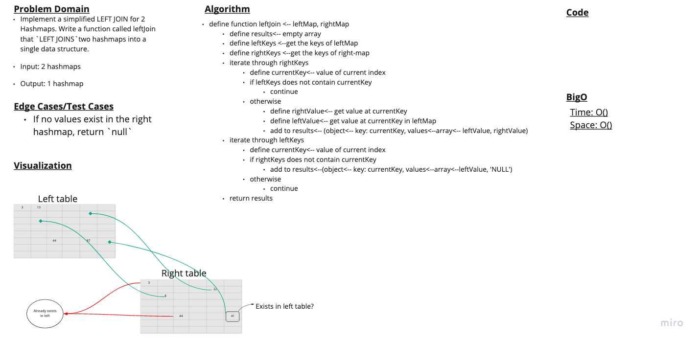

# Challenge 33

## Left Join

### Problem Domain

Write a function that `LEFT JOINs` two hashmaps into a single data structure.

- Write a function called left join
- Arguments: two hash maps
  - The first parameter is a hashmap that has word strings as keys, and a synonym of the key as values.
  - The second parameter is a hashmap that has word strings as keys, and antonyms of the key as values.
- Return: The returned data structure that holds the results is up to you, so long as it achieves the LEFT JOIN logic

### Whiteboard

### Approach & Efficiency

Time: O()
Space: O()

### Solution

- [Link to Implementation](../../implementations/hash-table/index.js)

### Testing

- [Link to Tests](../../__tests__/hashTable.test.js)
