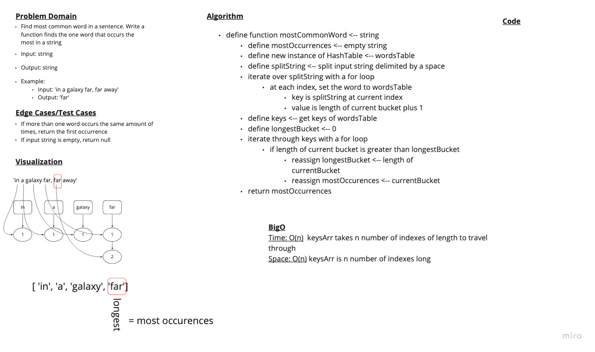

# Challenge 34

## Mock Interview 6

### Problem Domain

Determine the most common word in a book. Write a function that determines the most common word in a book.

### Whiteboard

### Grading Rubric

- [Link to Grading Rubric](https://docs.google.com/spreadsheets/d/1ltHpTsEhrhad9v4SS19bX_wadCz9KO-EMd13IdYBnbU/edit#gid=0)

### Approach & Efficiency

Time: O(n)
Space: O(n)

### Solution

- [Link to Implementation](../../implementations/hash-table/HashTable.js)

### Testing

- [Link to Tests](../../__tests__/hashTable.test.js)
