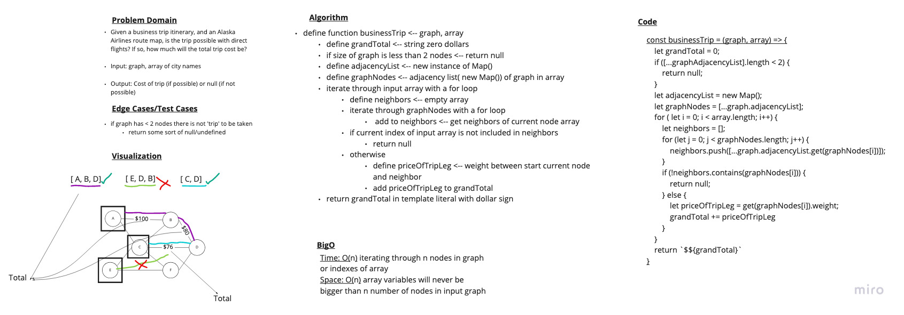

# Challenge 37

## Graph - Business Trip

### Problem Domain

Given a business trip itinerary, and an Alaska Airlines route map, is the trip possible with direct flights? If so, how much will the total trip cost be?

- Write a function called business trip
  - Arguments: graph, array of city names
  - Return: the cost of the trip (if it’s possible) or null (if not)

Determine whether the trip is possible with direct flights, and how much it would cost.

### Whiteboard

### Approach & Efficiency

Time: O(n) iterating through n nodes in graph or indexes of array
Space: O(n) array variables will never be bigger than n number of nodes in input graph

### Solution

- [Link to Implementation](../../implementations/graphs/Graph.js)

### Testing

- [Link to Tests](../../__tests__/Graph.test.js)
