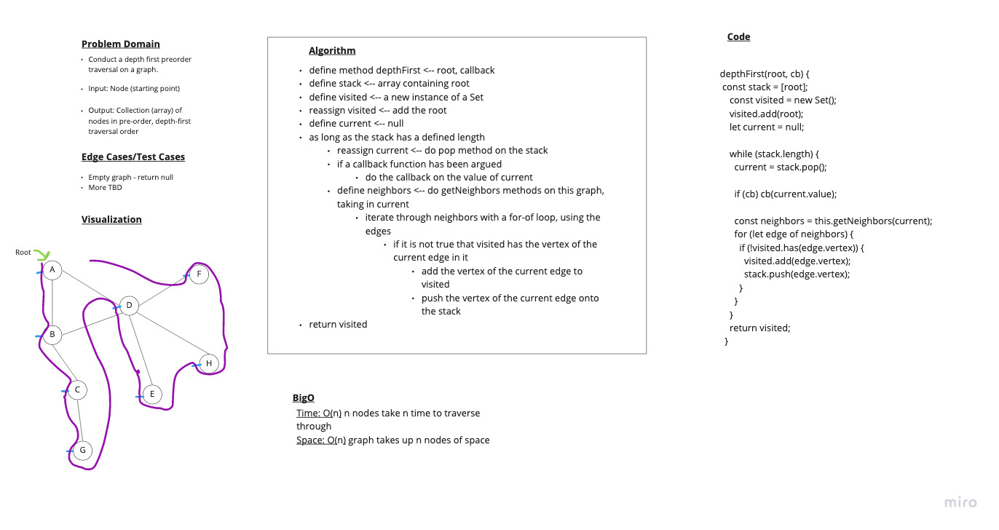

# Challenge 38

## Graph - Depth First

### Problem Domain

Conduct a depth first preorder traversal on a graph.
Write the following method for the Graph class:

- Name: Depth first
- Arguments: Node (Starting point of search)
- Return: A collection of nodes in their pre-order depth-first traversal order
- Program output: Display the collection

### Whiteboard

### Approach & Efficiency

Time: O(n) nodes takes n time to traverse through
Space: O(n) graph takes up n nodes of space

### Solution

- [Link to Implementation](../../implementations/graphs/Graph.js)

### Testing

- [Link to Tests](../../__tests__/Graph.test.js)
