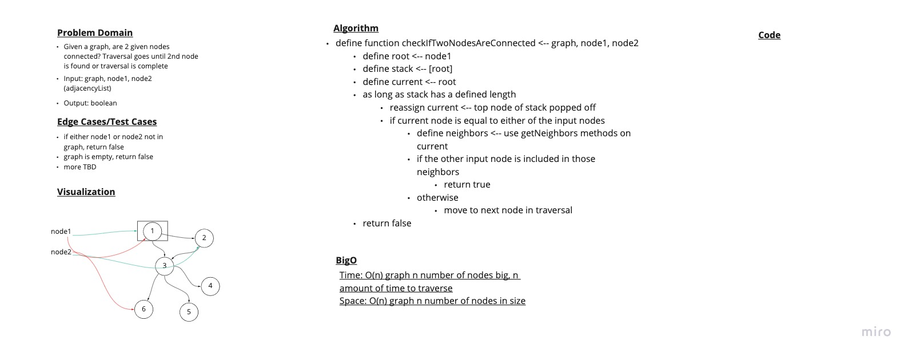

# Challenge

## Mock Interview 7

### Problem Domain

Given a graph and 2 nodes, check if the 2 nodes are connected in the graph

Input: graph, node1, node2
Output: boolean

### Whiteboard

### Approach & Efficiency

Time: O(n) n amount of time to traverse through n amount of nodes in graph
Space: O(n) graph takes up n number of nodes of space

### Grading rubric from partner/interviewer

[Rubric](https://docs.google.com/spreadsheets/d/1AUQrKNIsFTikGSUAdgc1KCdekgNqODIy8Tth2O8ZijU/edit?usp=sharing)
