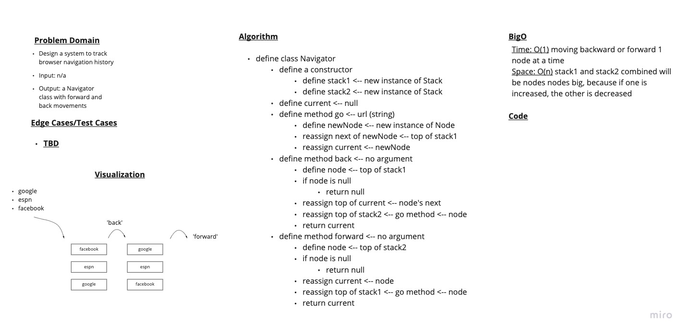

# Challenge 40

## Mock Interview 8

### Problem Domain

Design a system to track browser navigation history

- Input: n/a
- Output: Create a `Navigator` class responsible for tracking history as well as `forward` and `back` movements

### Whiteboard

### Approach & Efficiency

Time: O(1) - traveling forward or back 1 node at a time
Space: O(n) - stack1 and stack2 combined will be n nodes big because if one is increased, the other is decreased

### Grading Rubric from partner

- [Rubric](https://docs.google.com/spreadsheets/d/1S6TSRVCac8ib7ESLR-eU_VL51ByOANErKAq5uoBHkIg/edit?usp=sharing)
