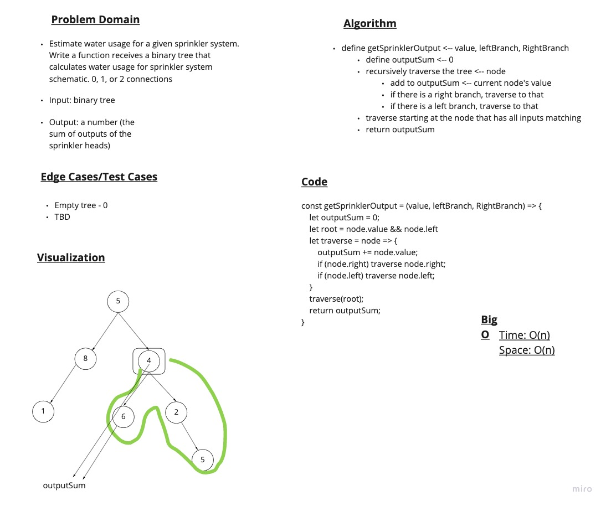

# Challenge 43

## Mock Interview 9

### Problem Domain

- Estimate water usage for a given sprinkler system. Write a function that receives a binary tree that calculates water usage for a sprinkler system schematic.
- Input: binary tree
- Output: number (sum of outputs of each sprinkler head)
  
### Approach & Efficiency

- Time: O(n)
- Space: O(n)

### Whiteboard and rubric

- [Grading Rubric](https://docs.google.com/spreadsheets/d/1VH6L4XGe0MtIUPpTvK29ZFN8hxROhDYtC1LmYeYWFU0/edit?usp=sharing)
- Whiteboard
  - 
